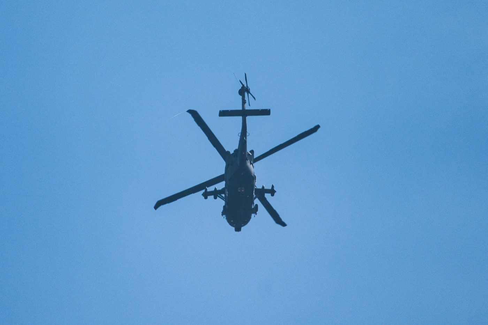
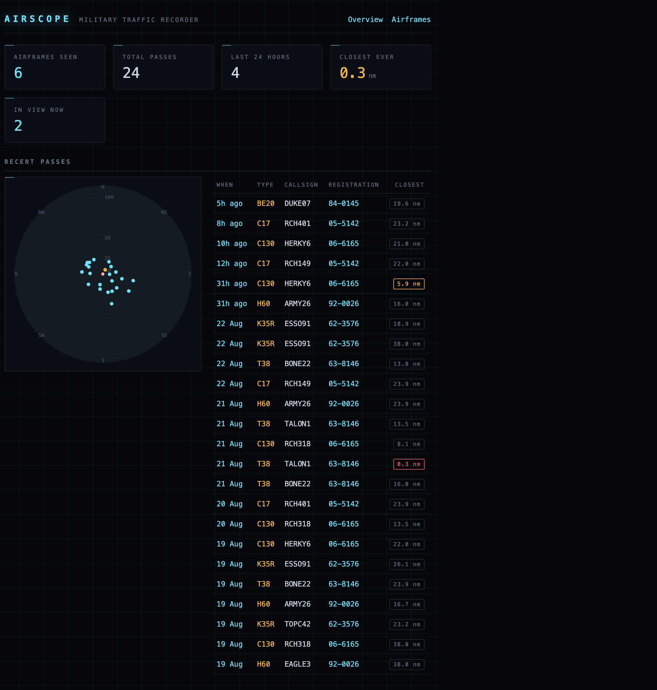
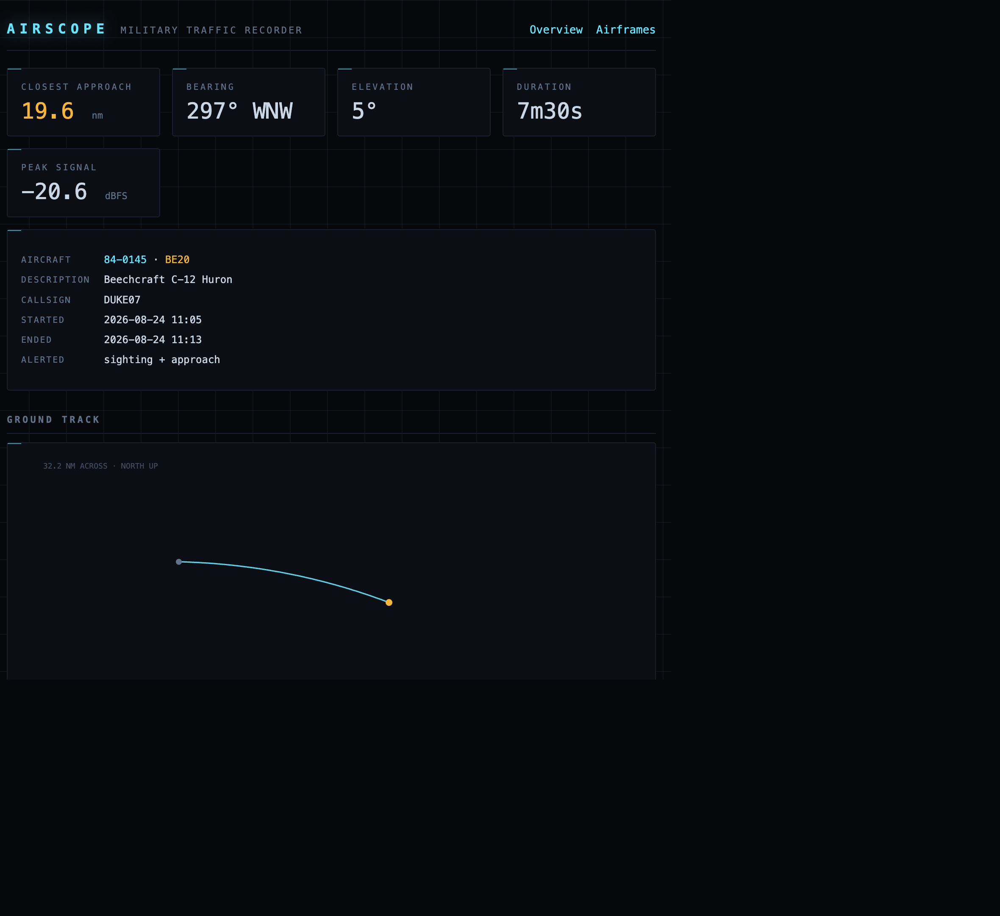
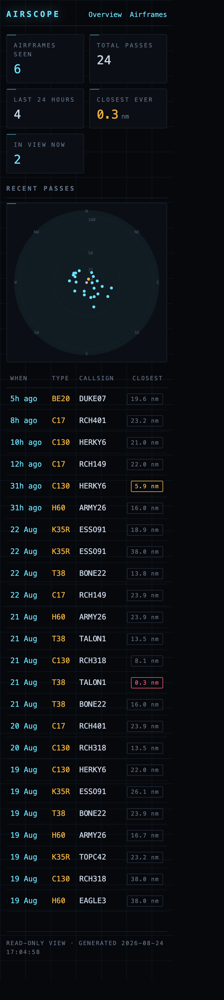

# AirScope



<sup>Photographed after an AirScope alert — Sony a6500, 70-350mm.</sup>

Watches a local [tar1090](https://github.com/wiedehopf/tar1090) / readsb ADS-B
receiver and tells you when a military aircraft is overhead — once when it is
first identified, and again a few minutes before one is predicted to pass
directly over you, so you have time to get outside with a camera.

Includes a read-only web UI that records every pass: ground track, altitude
profile, closest approach, and a photo of the exact airframe.

* Python 3.8+, standard library only. No `pip install`, no `jq`, no framework.
* Two small services: a poller and an optional web UI.
* Notifies via Prowl, ntfy, a generic webhook, or any shell command.



---

## Why this is not just `grep dbFlags`

readsb marks military aircraft with a `dbFlags` bitmask in `aircraft.json`
(bit 0 = military). If your receiver has the aircraft database loaded, that is
all you need, and AirScope will use it.

Many receivers **don't** have it. On those, `aircraft.json` carries no
`dbFlags`, no registration and no type at all — the tar1090 *web page* looks
them up client-side from a static database it serves itself, as a prefix trie
of gzipped JSON:

```
<base>/db-<hash>/<PREFIX>.js
  -> {"<rest-of-hex>": [reg, type, flags, desc], "children": ["A0","A1", ...]}
```

`flags` is a **binary string, least-significant bit first** — position 0 is
military. (tar1090's own `planeObject.js` tests `data[2][0] == '1'`; values like
`"11000"` mean it is not a hex number.) AirScope walks the same trie, caches
blocks on disk, and auto-discovers the `db-<hash>` folder name from the tar1090
index page — that hash changes whenever the database updates, so hardcoding it
would silently stop detection.

A useful side effect: the lookup also backfills registration, type and
description on feeds that lack them.

---

## Install

```sh
git clone https://github.com/YOU/AirScope && cd AirScope
sudo mkdir -p /opt/airscope && sudo cp airscope.py airscope-web.py /opt/airscope/
sudo cp airscope.conf.example /etc/airscope.conf
sudo chmod 600 /etc/airscope.conf        # if it will hold credentials
```

Edit `/etc/airscope.conf` — normally only `url` needs changing. Your observing
position is read from the receiver's `receiver.json`, so it does not need
configuring. Then check it works:

```sh
/opt/airscope/airscope.py --check
```

```
feed: http://192.168.1.20/tar1090/data/aircraft.json
  aircraft in feed : 19
  carrying dbFlags : 0
  carrying reg     : 0

database: http://192.168.1.20/tar1090/db-f2631e2
  resolved         : 19/19
  with position    : 17
  military         : 1
    MIL BE20 KNOX25 - 14 nm NW at 27000 ft - closest 8.3 nm in 2m20s, look 359 N, 28 deg up

observer: 39.00000, -98.00000
  sun            : 251 deg WSW, +40 deg elevation
```

`resolved: 19/19` is the number to look for. If it is `0/19`, pass `--db-url`
explicitly or check the receiver URL.

### As a service

```sh
sudo cp airscope.service.example /etc/systemd/system/airscope.service
sudo sed -i 's/__USER__/yourname/g' /etc/systemd/system/airscope.service
sudo systemctl daemon-reload && sudo systemctl enable --now airscope
journalctl -u airscope -f
```

The web UI is a separate unit so a bug there cannot take down alerting:

```sh
sudo cp airscope-web.service.example /etc/systemd/system/airscope-web.service
sudo sed -i 's/__USER__/yourname/g' /etc/systemd/system/airscope-web.service
sudo systemctl daemon-reload && sudo systemctl enable --now airscope-web
```

After changing any unit file: `sudo systemctl daemon-reload && sudo systemctl
restart <unit>`. Replacing the file alone leaves the old command line running.

---

## Alerting model

Nothing is ever filtered out. Geometry only affects **wording and priority**, so
you cannot miss an aircraft because it lacked a position or flew too high.

| Alert | When | Priority |
|---|---|---|
| **sighting** | the moment an aircraft is identified, wherever it is | `priority` (default 0, raised by 1 if a close pass is predicted) |
| **approach** | predicted to pass within `overhead_radius`, `lead_time` seconds out | `approach_priority` (default 1) |

Aircraft alerted in the same poll are combined into a single notification.

Closest approach is a straight-line projection from ground track and speed:

```
t_cpa = -(p·v)/|v|²      miss = |p + v·t_cpa|
```

It is therefore wrong the moment an aircraft turns. It is re-evaluated every
poll and must hold for `confirm_polls` (default 2) before firing.

Each aircraft alerts once per *visit*. A visit ends after `absence` seconds
without a sighting (default 600), which also absorbs signal dropouts — raise it
if one pass alerts twice, lower it if genuine return visits are missed.

Example approach alert:

```
C17 RCH149 overhead in 2m40s
Boeing C-17A Globemaster III
Reg 05-5142
28 nm N at 8000 ft
closest 0.4 nm in 2m40s, look 062 ENE, 64 deg up
front-lit
ICAO ae144c
```

`front-lit` / `backlit` / `side-lit` / `night` comes from the sun's position at
the predicted time of closest approach — at long focal lengths a backlit subject
is usually a write-off. It never suppresses an alert.

---

## Notifiers

Set `notifiers = prowl, ntfy` in the config. Priority is normalised `-2..2` and
mapped to each backend.

| Backend | Needs |
|---|---|
| `prowl` | `[prowl] key =` — the key itself, or a file containing it (default `~/.prowl_api_key`) |
| `ntfy` | `[ntfy] topic =` — pick something unguessable; anyone who knows a topic can read it |
| `webhook` | `[webhook] url =` — receives `{"event","body","link","priority"}` |

`--action` additionally runs a shell command per aircraft, with fields in the
environment: `$HEX $FLIGHT $REG $TYPE $DESC $OWNER $ALT $GS $SQUAWK $LAT $LON
$RSSI $DIST_NM $BEARING $MISS_NM $ETA_S $ELEVATION $ALT_CPA $LIGHT`.

Check credentials resolve without sending anything sensitive to a log:

```sh
airscope.py --print-config     # secrets shown only as "(set, N chars)"
airscope.py --test-notify      # one test message per configured notifier
```

---

## Web UI

```
http://<host>:8080
```

Overview with a range/bearing radar of recent passes, per-airframe history, and
a per-pass page with ground track and altitude profile. Reads the same SQLite
file the poller writes, opened **read-only**.



It renders no JavaScript — every chart is server-generated SVG — and works on a
phone, which is where you will usually open it from a notification.



Set `web_url` in the config to make notifications deep-link to the aircraft page
instead of the receiver's map. Use a literal IP rather than a hostname —
notifications are opened on a phone, which may be on a VPN with different DNS.

### Storage

Measured, not estimated, for one year at 20 minutes average time in view:

| contacts/day | database after 1 year |
|---|---|
| 10 | 4.2 MB |
| 30 | 12.0 MB |
| 100 | 39.5 MB |

Track points are stored as one zlib-compressed blob per visit — 8.6 bytes per
point versus 76.2 as SQL rows, at full resolution. **No pruning is needed.**

---

## Security

* The web UI is **read-only and unauthenticated**. It defaults to `0.0.0.0:8080`
  so notification links open on a phone. The database records your position and
  when you are observing — keep it on a trusted network, never port-forward it.
  For a private setup use `--bind 127.0.0.1:8080` and an SSH tunnel.
* It renders **no JavaScript**, so its Content-Security-Policy is
  `default-src 'none'`. Everything from the feed is HTML-escaped: callsigns are
  eight arbitrary bytes chosen by whoever is transmitting.
* For the same reason, aircraft data reaches `--action` as environment variables
  and is never interpolated into the command string. If you rewrite that with an
  f-string you reintroduce a shell injection reachable by anyone with a
  transmitter.
* Credentials belong in a file or `/etc/airscope.conf` (`chmod 600`), not on the
  command line where `ps` can see them.
* **Never commit a captured `aircraft.json`.** Every aircraft carries `r_dst` —
  its range from *your* antenna — so a dozen of them trilaterate your receiver
  to within ~15 metres. `.gitignore` covers this; `fixtures/` is synthetic.

---

## Credits

Detection is reverse-engineered from Wiedehopf's
[tar1090](https://github.com/wiedehopf/tar1090) and
[tar1090-db](https://github.com/wiedehopf/tar1090-db); the aircraft database
served by your receiver is his work. Enrichment uses
[adsbdb](https://www.adsbdb.com/) and
[Planespotters.net](https://www.planespotters.net/photo/api) — both free, both
without an API key, both credited in the UI.

## Licence

GPL-3.0-or-later. See [LICENSE](LICENSE).
